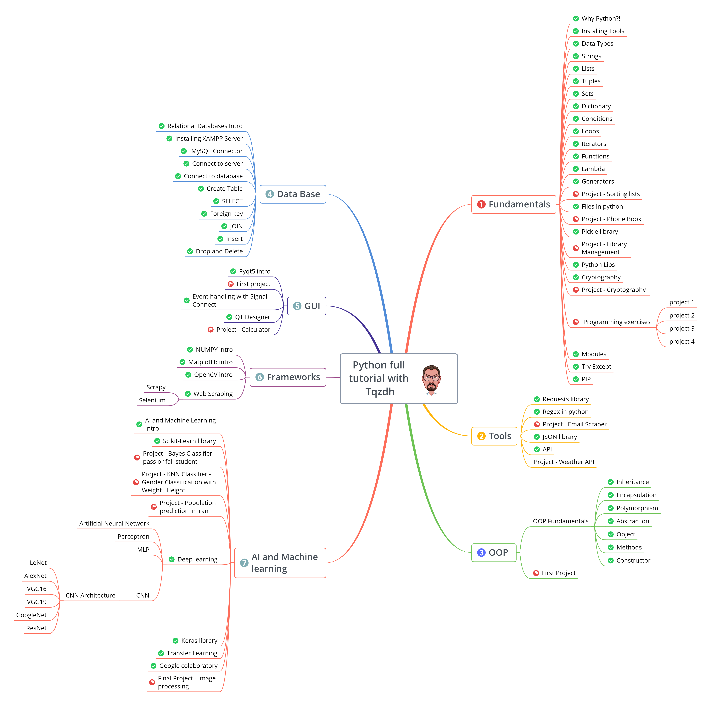
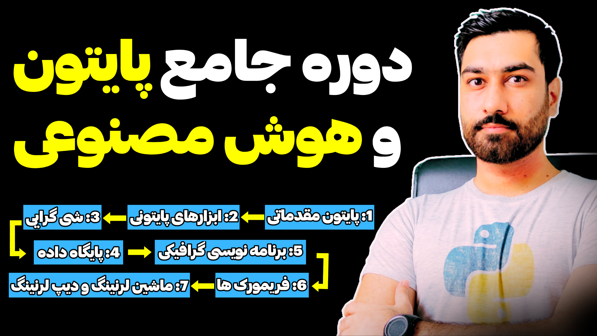

# Complete Python Programming Course  
**72 Episodes | ~22 Hours of Content**

This comprehensive learning path is designed to take you from zero Python knowledge to the essential skills required to become an **AI Engineer**. The course gradually builds strong programming foundations and then moves toward real-world AI and Machine Learning concepts.

## Learning Roadmap (7 Steps)

1. **Python Fundamentals & Procedural Programming**
2. **Essential Python Tools**
3. **Object-Oriented Programming (OOP)**
4. **MySQL Database Integration**
5. **GUI Programming**
6. **Popular Python Libraries & Frameworks**
7. **Machine Learning And Deep Learning**

---

## 📌 Course Resources

### 🔹 YouTube Channel  
**آموزش جامع پایتون با تمرکز بر هوش مصنوعی در 22 ساعت**  
🎥 https://www.youtube.com/c/MohammadTaghizadeh

---

