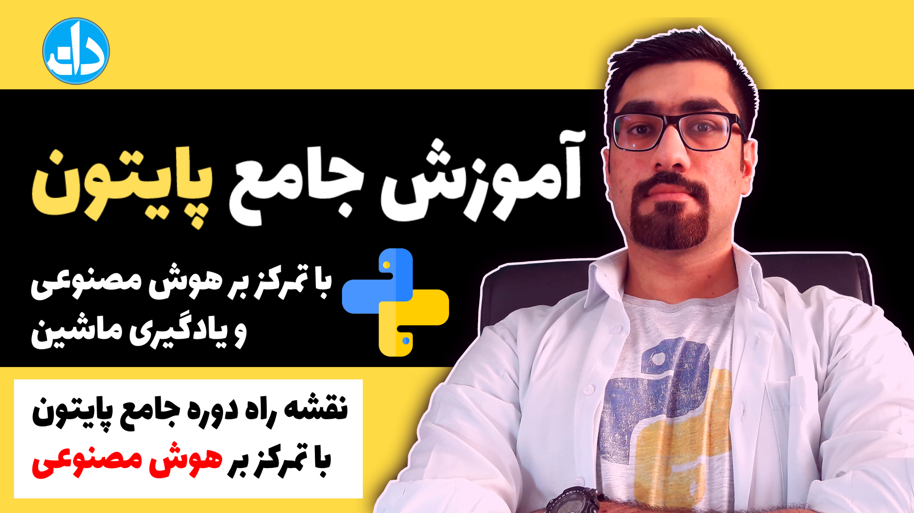

# Full Python Programming Tutorials in 72 episodes (22 h)

7 steps outline:
1. Python Fundamental and procedural programming methodology
2. Python tools
3. Object oriented programming methodology
4. MySql database
5. GUI Programmig
6. Popular Packages and frameworks in python
7. Machine Learning

see tutorial from here : https://www.daneshjooyar.com/python/
see Python Fundamental and procedural programming methodology(free youtube playlist) :) : https://www.youtube.com/watch?v=3-ndqjYlFaU&list=PLCYuHRopfbET2B91Dsp4_S1SUPX0bc-8D

